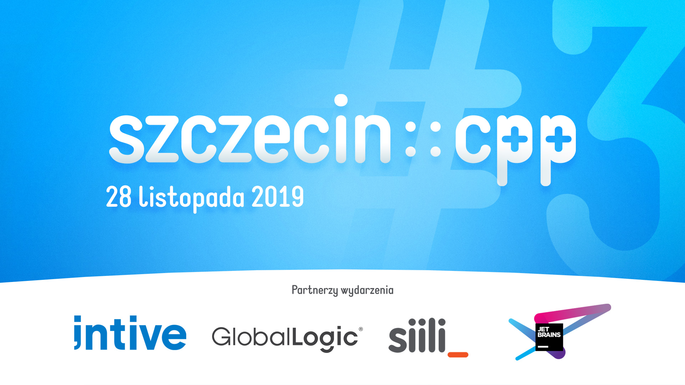

## szczecin::cpp #3

Prezentacje:
* Michał Cichowicz: **Bare metal i C++ na przykładzie Raspberry Pi i biblioteki Circle** ([PDF](01-rpi-baremetal.pdf))
* Hubert Liberacki: **C++ accessing private member – how we've been lied to**
* Marcin Lisowski: **Zrozumieć lambdy w C++** ([PDF](03-lambdas.pdf))

Partnerzy wydarzenia:
* [intive](https://intive.com)
* [GlobalLogic](https://www.globallogic.com)
* [Siili Solutions](https://www.siili.com)
* [JetBrains](https://www.jetbrains.com)
